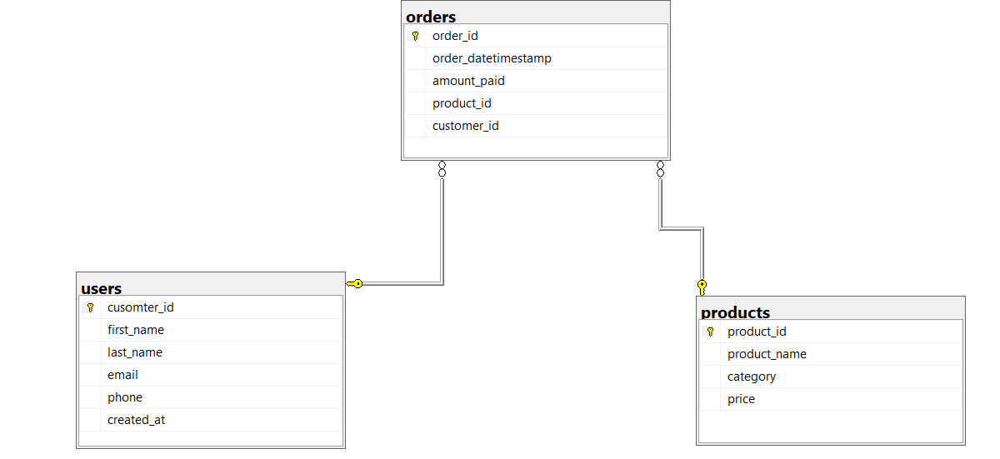

#  E-Commerce SQL Analysis

##  Overview
This project analyzes customer orders, product sales, and revenue trends using SQL.

The database contains Users, Orders, and Products tables connected using primary and foreign keys.

This project demonstrates SQL skills used in data analysis and business reporting.

---

#  ER Diagram

---

# 📈 Analysis Performed

- Customer order analysis
- Revenue analysis
- Best-selling products
- Highest spending customers
- Monthly sales trends
- Inactive customers analysis

---

# 📁 Files Included

- Orders_Users_Products.sql
- ER-Diagram.png
- README.md

---

#  Author

Astuti

📧 astutijha.12345@gmail.com
